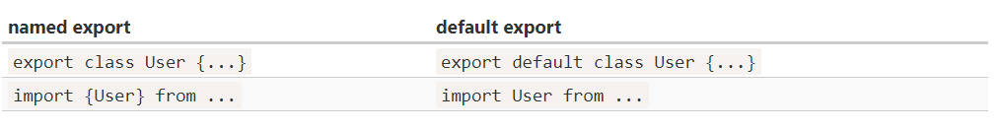

## 모듈

---

자바스크립트 내에서, 모듈은 하나의 파일이라고 정의 할 수 있습니다.

그래서 파일을 불러오거나 내보내는 역할이 필요한데, 

import와 export 키워드를 통해 구현 할 수 있습니다.

<br><br>
### import와 export

---

- `export` 키워드를 변수나 함수 앞에 붙이면 외부 모듈에서 해당 변수나 함수에 접근할 수 있습니다(`모듈 내보내기`).
- `import` 키워드를 사용하면 외부 모듈의 기능을 가져올 수 있습니다(`모듈 가져오기`).

<br><br>

다음은 export 키워드를 사용해 파일 test.js에서 함수 exTest를 외부에 보내는 코드입니다.

```jsx
export function exTest(user) {
	alert(`Hello ${user}`);
}
```

<br><br>

다음은 import 키워드를 사용해 intest.js에서 test.js의 함수 exTest를 사용할 수 있게 하는 코드입니다.

```jsx
import {exTest} from './test.js';

exTest('Jordan'); // Hello Jordan
```

### 특징

---

다음은 모듈이 가지는 특징들 입니다.

- 엄격 모드로 실행됨

모듈은 항상 엄격모드로 실행됩니다.

```jsx
<script type="module">
  a = 5; // 에러입니다.
</script>
```

- 자신만의 스코프 존재

모듈은 자신만의 스코프가 있습니다. 따라서 모듈 내부에서 정의한 변수나 함수는 다른 스크립트에서 접근할 수 없습니다.

- 단 한번만 실행됨

모듈은 최초 호출시, 단 한번만 실행된다는 특징을 가지고 있습니다. 실행 후 결과는 이 모듈을 가져가려는 모든 모듈에 내보내 집니다.

다음은 1.js 그리고 2.js에서 alert.js 파일을 불러와서 모듈이 한번만 실행 되는지 확인해보는 코드입니다. 

```jsx
// alert.js
alert('Test');
```

```jsx
// 1.js
import './alert.js'; // Test가 출력이 됩니다.
// 2.js
import './alert.js'; // 발생하지 않습니다. 이미 1.js에서 출력된 결과만 남아있기 때문입니다.
```

<br><br><br>

### as

---

다음은 as라는 키워드를 알아 보겠습니다.

as를 사용하면, 모듈을 불러오거나 내보낼 때 다른 키워드를 사용해 보낼 수 있습니다.

say.js에서 hi나 bye로 이름을 바꿔서 내보내게 됩니다.

```jsx
// 📁 say.js
...
export {sayHi as hi, sayBye as bye};
```

이제 다른곳에서 파일을 불러오게 되면 hi나 bye로 써야합니다.

```jsx
// 📁 main.js
import * as say from './say.js';

say.hi('Jordan'); // Hello, Jordan!
say.bye('Jordan'); // Bye, Jordan!
```

<br><br><br>

### export default

---

그 다음은 export default에 대해 알아 보겠습니다.

export default는 해당 모듈엔 개체가 하나만 있다’는 사실을 명확히 나타낸다는 의미입니다.

<br><br>

default 키워드를 써서 export를 하게 되는 코드가 있습니다.

```jsx
// 📁 user.js
export default class User { // export 옆에 'default'를 추가해보았습니다.
  constructor(name) {
    this.name = name;
  }
}
```

그런데, main.js에서 user.js로부터 import할 때 중괄호를 쓰지 않는 다는 점이 특이점입니다.

```jsx
// 📁 main.js
import User from './user.js'; // {User}가 아닌 User로 클래스를 가져왔습니다.

new User('John');
```

<br><br>

그래서, default의 유무에 따라 다음과 같은 차이점을 가지고 있습니다.



출처 : [javascript module 개념 정리](https://ko.javascript.info/import-export)