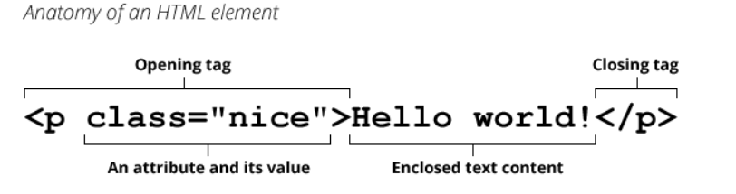
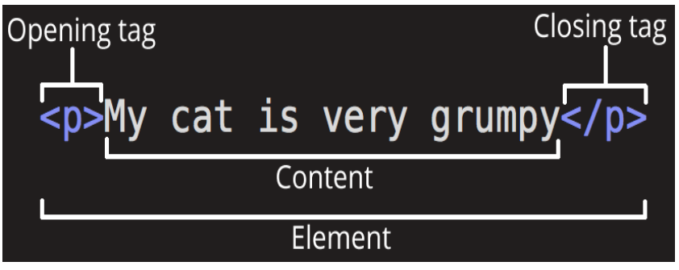

## HTML

  

`HTML`은 웹페이지가 어떻게 구조화 되어있는지 브라우져가 알수 있게 기술된 `마크업 언어(Markup Language)`입니다.

> element vs tag

HTML에서 `element는 웹 페이지를 구성한다`는 의미입니다.

일반적인 요소는 여는 태그와 몇 가지 특성, 내부의 텍스트 콘텐츠, 닫는 태그로 구성됩니다.

그러나, `tag는 element를 만들때 사용되는 틀`입니다. 

그러므로, element와 tag는 같지 않고 element를 만들기 위해 tag가 사용이 된다고 이해하는 것이 옳습니다.

   

### HTML Element의 구조

---

- Opening Tag : Element의 이름(이 경우 p)과, 열고 닫는 꺽쇠로 구성됩니다.(<>)
- Closing Tag : Opening Tag와 유사한 형태인데, Element의 이름앞에 / 이것이 추가된 형태이다.
- Content : Element의 내용입니다.
- Element : 위의 3가지 경우를 다 합쳐서 Element라고 부릅니다.

   

### Attribute

---

다음은 Attribute에 관한 설명입니다.

Attribute는 `Element에 추가적인 정보를 넣고 싶은 경우` 사용이 됩니다.

위의 경우는 class Attribute를 이용하여 표현했습니다.

Attribute의 경우, 다음의 규칙들을 준수하여 사용해야 합니다.

1. 요소 이름 다음에 바로 오는 속성은 요소 이름과 속성 사이에 공백이 있어야 되고, 하나 이상의 속성들이 있는 경우엔 속성 사이에 공백이 있어야 합니다.
2. 속성 이름 다음엔 등호(=)가 붙습니다.
3. 속성 값은 열고 닫는 따옴표로 감싸야 합니다.

3번의 경우에서, `열고 닫는 따옴표가 작은 따옴표이건 큰 따옴표이건 상관은 없습니다.
다만 섞어 쓰면 안되므로`, 그 점을 유의합니다.