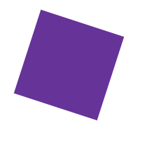

## Selectors

각 CSS 규칙은 선택자 또는 선택자 목록으로 시작하여 규칙을 적용해야 하는 요소 또는 요소 규칙을 브라우저에게 알려줍니다.

<br><br>

그래서 다음처럼 다양한 선택자 표현들이 존재합니다.

```css
h1
a:link
.manythings
#onething
*
.box p
.box p:first-child
h1, h2, .intro
```

<br><br><br>

### 우선 순위

---

다음과 같은 코드가 있습니다.

```css
.special {
  color: red;
}

p {
  color: blue;
}
```

이런 경우, 아래 코드의 색깔에 대한 의문이 들 수 있습니다.

```html
<p class = "special">나의 색깔</p>
```

결론부터 얘기하면, 글씨색깔은 빨간색입니다. 왜냐하면, class 는 요소 선택자(해당 예제에서 p element) 보다 더 구체적이거나 더 우선 순위가 높기 때문입니다.

<br><br><br>

### Function

---

CSS 내부에는 함수의 형태를 취하는 것들이 존재합니다.

대표적으로 calc() 함수입니다.

```html
<div class="outer"><div class="box">The inner box is 90% - 30px.</div></div>
```

```css
.outer {
  border: 5px solid black;
}

.box {
  padding: 10px;
  width: calc(90% - 30px); /*블록 너비의 90% 에서 30 px 을 뺀 값입니다.*/
  background-color: rebeccapurple;
  color: white;
}
```

실행해보면 다음과 같이 나옴을 알 수 있습니다.


<br><br>

또 다른 경우는 rotate() 함수입니다.

```css
.box {
  margin: 30px;
  width: 100px;
  height: 100px;
  background-color: rebeccapurple;
  transform: rotate(0.8turn)
}
```

다음처럼 기울여 졌다는 것을 알 수 있습니다.  


<br><br><br>

### @rules

---

이것들은 CSS 에 행동 방법에 대한 지침을 제공하는 특수 규칙입니다

추가 스타일 시트를 가지고 올때는 `@import`를 이용합니다

```css
@import 'style.css';

 
div {
    color : yellow;
}

/*style.css*/
div {
	color : green;
}
```

<br><br>

위 코드는 style.css를 import 해서 가지고 온 코드입니다.

style.css를 import 해서 가지고 왔는데, `요소가 겹치게 될 경우` 

그 때는, `import한 style.css가 아니라 원본의 값이 선택`이 됩니다.

```html
<div> green? </div>
```

그러므로 green이 아니라, yellow가 됩니다.

<br><br>

추가적으로 알아두면 좋은 것은,  `브라우져에서 인식하지 못하는 CSS를 만나는 경우 그 문장을 넘어가서 다음 문장을 수행합니다.`

위에서 언급하지 않은 Selectors도 존재합니다.  
더 많은 Selectors들을 참고하려면 다음 사이트를 참고해주세요.

출처 : [More About Selectors](https://developer.mozilla.org/en-US/docs/Learn/CSS/Building_blocks/Selectors)


