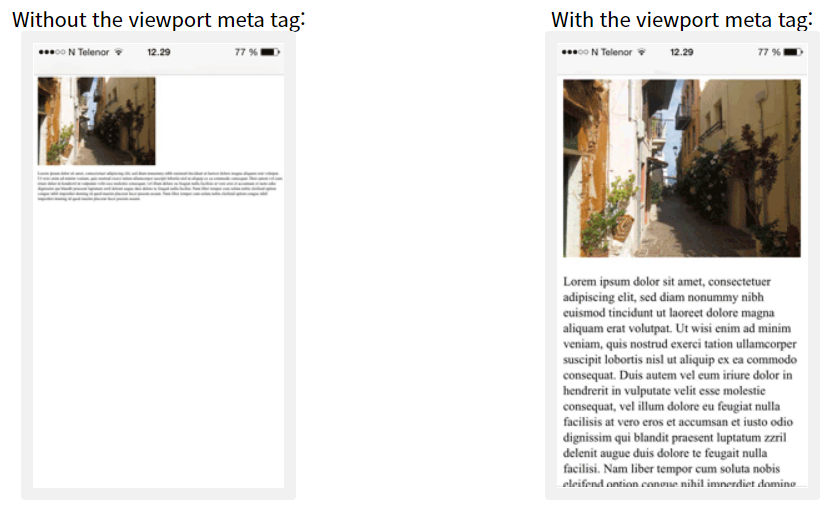
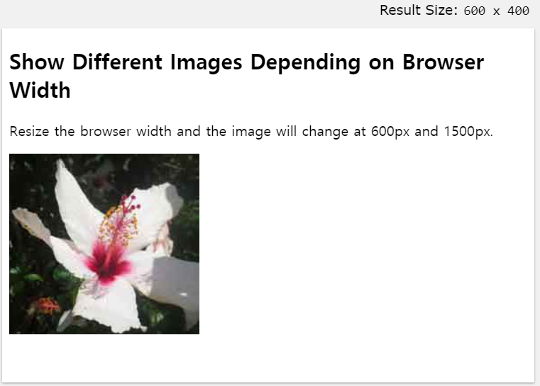
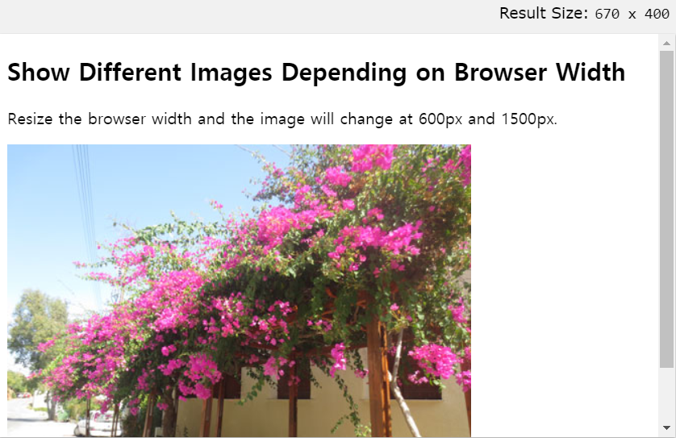
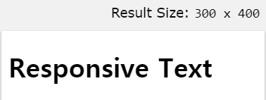
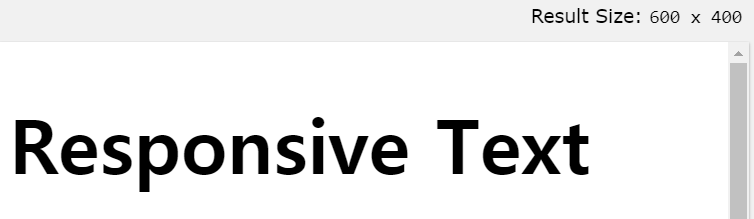

## Responsive Web

<br>

Responsive Web은 `디바이스 종류에 따라 웹페이지의 크기가 자동적으로 재조정 되는 것`을 말합니다.

<br>

먼저, meta 태그의 코드를 넣으면 다음과 같은 효과를 볼 수 있습니다.

```html
<meta name="viewport" content="width=device-width, initial-scale=1.0">
```

<br><br>

페이지의 `뷰포트가 설정`되어 `브라우저에서 페이지의 크기 및 배율을 제어`하는 방법에 대한 지침을 제공합니다.



<br><br><br>

### Responsive Image

---

Responsive Image를 만드려면, Image가 모든 브라우저 크기에 맞게 확장되는 이미지의 형태로 변해야 합니다.

`CSS width속성을 100 %로 설정`하면 이미지가 반응하고 확대 및 축소됩니다

예를 들면 다음과 같은 형태로 쓰면 됩니다.

```html

```

<br><br>

```html
<!DOCTYPE html>
<html>
<meta name="viewport" content="width=device-width, initial-scale=1.0">
<body>

<h2>Responsive Image</h2>
<p>"max-width:100%" prevents the image from getting bigger than its original size. However, if you make the browser window smaller, the image will still scale down.</p>
<p>Resize the browser window to see the effect.</p>


</body>
</html>
```

또한 `브라우져 너비에 따라 다른 이미지`를 보여줄 수도 있습니다.

이때 `picture element`를 이용하여 표현할 수 있습니다.

<br><br>

```html
<!DOCTYPE html>
<html>
<meta name="viewport" content="width=device-width, initial-scale=1.0">
<body>

<h2>Show Different Images Depending on Browser Width</h2>
<p>Resize the browser width and the image will change at 600px and 1500px.</p>

<picture>
  <source srcset="https://www.w3schools.com/html/img_smallflower.jpg" media="(max-width: 600px)">
  <source srcset="https://www.w3schools.com/html/img_flowers.jpg" media="(max-width: 1500px)">
  <source srcset="https://www.w3schools.com/html/flowers.jpg">
  
</picture>

</body>
</html>
```

max width가 600px까지인 경우는 다음과 같은 그림이 나옵니다.



그러나, 600px보다 커지는 경우는 다른 그림이 등장합니다.



<br><br><br>

### Responsive Text

---

텍스트 크기는 "뷰포트 너비"를 의미하는 `"vw"`단위로 설정할 수 있습니다

뷰포트는 브라우저 창 크기입니다. 예를 들면, `1vw = 뷰포트 너비의 1 %`. 뷰포트의 너비가 50cm이면 1vw는 0.5cm입니다.

<br>

```html
<!DOCTYPE html>
<html>
<meta name="viewport" content="width=device-width, initial-scale=1.0">
<body>

<h1 style="font-size:10vw;">Responsive Text</h1>

<p style="font-size:5vw;">Resize the browser window to see how the text size scales.</p>

<p style="font-size:5vw;">Use the "vw" unit when sizing the text. 10vw will set the size to 10% of the viewport width.</p>

<p>Viewport is the browser window size. 1vw = 1% of viewport width. If the viewport is 50cm wide, 1vw is 0.5cm.</p>

</body>
</html>
```





width가 300일때와 600일때를 비교해보면, 글씨크기가 유동적으로 변한다는 것을 알수 있습니다.