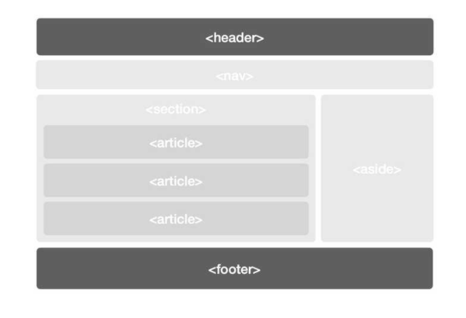
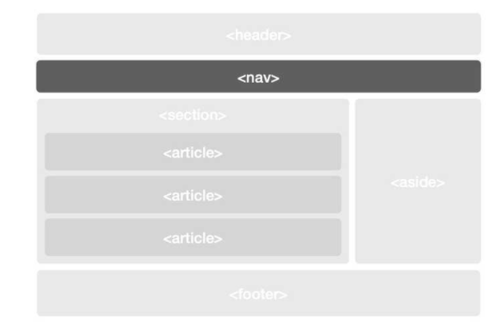
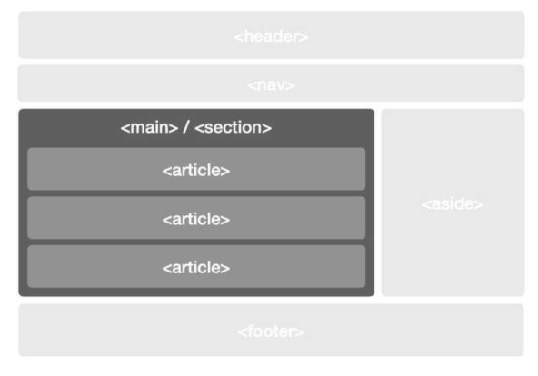
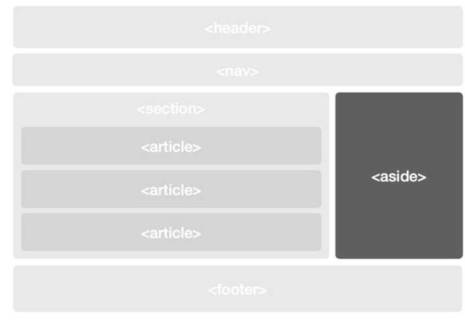

## HTML Semantic에 대해

 

먼저, Semantic에 대한 의미를 설명하겠습니다.

Semantic이란 프로그래밍에서 그 `코드의 의미`를 나타냅니다.
 

예를 들면, Javascript 라인을 실행하는 것은 어떤 효과가 있는것인지, 혹은 이 HTML element가 가진 목적이나 역할은 무엇인지에 대한 것을 뜻합니다.

  

HTML에서 h1 태그는 HTML Semantic element입니다.

왜냐하면, h1 태그가 제목 처럼 보이도록 큰 사이즈의 폰트로 만들어지기 때문입니다.

(물론, span 태그를 이용하여 속성값의 font size를 크게 하여 h1 태그의 형태처럼 구성을 할 수도 있습니다. 그러나, 큰 제목의 형태라는 의미에 좀 더 적합한 h1 태그가 있기 때문에 span 태그를 구성하는 것은 Semantic 스럽지 못하다라고 볼수 있습니다.)

  

그래서 HTML에서 Semantic하게 작성한다는 의미는 `각 태그들의 의미를 제대로 살려 HTML 웹 페이지 형태를 보여준다`는데 의의가 있습니다.

  

또한 Semantic하게 작성하게 되면 `검색엔진 최적화` 효과도 볼 수 있기 때문에, 일반적으로 웹 문서를 Semantic하게 구성을 해야 하는 또다른 이유가 있습니다.

   

### 일반적인 HTML 페이지 구조

---

HTML 페이지를 구성하는데 있어 일반적으로 정해진 틀이 있는데 다음과 같습니다.

  

- header와 footer

모두 `문서(전체 웹페이지 또는 특정 영역)의 부가정보를 표기하는 데 사용`한다. <header>에 `문서의 제목, 로고, 작성자, 작성일과 같은 메타 정보를 배치`한다. 

그리고 <footer>에는 회사 정보나 소유자의 소셜미디어 정보, 약관 등 `문서와 관련이 적은 부가정보를 배치`한다.

주의 사항은, `header와 footer를 중첩해서 사용하면 안된다.`

   

- nav

내비게이터(navigator)를 의미한다. `사이트 전체 흐름을 제어`하는 기능을 담당한다. `페이지 이동` 등의 주요 메뉴가 배치된다. 구조에 따라 문서 상단이나 측면에 위치하기도 한다. `전체 페이지의 흐름을 담당`하기 때문에 문서의 변화와 상관없이 항상 노출하는 경우가 많다.

   

- main과 article 및 section

main은 `문서에서 오직 한 번만 사용`한다. `본문을 뜻하며, 콘텐츠 내용 전체를 감싼다`.

 그에 비해 article과 section은 좀 더 자유롭다. 하나의 article 안에 여러 개의 section이 있을 수 있고, 반대의 경우도 가능하다.

   

- aside

aside는 `본문 옆에 구성`한다. 보통은 `본문과 직접적으로 관련 없는 내용이 배치`된다. 블로그에서 측면의 카테고리 목록이나 태그 목록 등이 포함된 영역이 이에 해당한다. 

하지만, aside를 본문 내에서도 사용할 수 있다. 

`article 혹은 section에 aside가 위치`하면, `본문 내용과 관련된 부가정보를 노출`한다. `주석이나 각주` 등이 이에 해당한다.