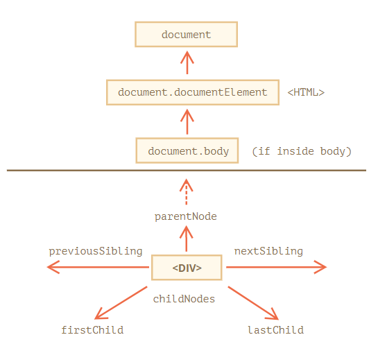
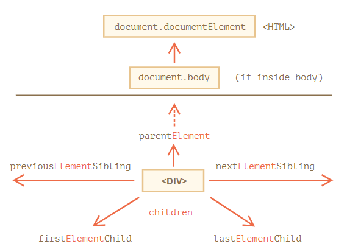

## DOM 탐색

---

DOM을 통해 다양한 기능들을 구현 할 수 있습니다.

그러나, DOM 객체에 접근하여 조작을 하거나, 탐색을 하지 못한다면

제대로 사용할 수 없게 됩니다.

**DOM에 수행되는 모든 연산은 document객체에서 시작**됩니다.

<br><br>



<br><br><br>

### 트리 상단의 documentElement와 body

---

DOM 트리 상단의 노드들은 `document`가 제공하는 프로퍼티를 사용해 접근할 수 있습니다.

- **`<html>` = `document.documentElement`**

`document`를 제외하고 DOM 트리 꼭대기에 있는 문서 노드는 `<html>` 태그에 해당하는 `document.documentElement`입니다. 

- **`<body>` = `document.body`**

`<body>` 요소에 해당하는 DOM 노드로, 자주 쓰이는 노드 중 하나입니다.

- **`<head>` = `document.head`**

`<head>` 태그는 `document.head`로 접근할 수 있습니다.

<br><br><br>

### childNodes

---

위의 그림중 대표적으로 childNodes 탐색에 대해서 알아보겠습니다.

예시로는 다음과 같이 쓸수 있습니다.

```html
<html>
<body>
  <div>시작</div>

  <ul>
    <li>항목</li>
  </ul>

  <div>끝</div>

  <script>
    for (let i = 0; i < document.body.childNodes.length; i++) {
      alert( document.body.childNodes[i] ); // Text, DIV, Text, UL, ... , SCRIPT
    }
  </script>
  ...추가 내용...
</body>
</html>
```

위의 코드에서 흥미로운 점은 ...추가내용... 부분은 alert문장에 출력이 되지를 않습니다.

왜냐하면, 스크립트 실행 시점에선 브라우져가 추가한 내용을 읽지 못해 스크립트도 ...추가 내용... 부분은 보지 못해서 그렇기 때문입니다.

<br><br><br>

### 요소 간 이동

---

지금까지는 모든 노드에 적용가능한 DOM 탐색에 대해 설명 하였습니다.

그러나, 이번에는 요소 노드에만 적용 되는 탐색에 대해 알아보겠습니다

<br><br>



앞서 보았던 그림과 유사합니다. Element라는 키워드가 추가되었다라고 보시면 됩니다.

<br><br>

위의 그림을 적용해 예시 코드를 이렇게 써볼 수 있습니다.

```html
<html>
<body>
  <div>시작</div>

  <ul>
    <li>항목</li>
  </ul>

  <div>끝</div>

  <script>
    for (let elem of document.body.children) {
      alert(elem); // DIV, UL, DIV, SCRIPT
    }
  </script>
  ...
</body>
</html>
```

children이라는 키워드를 통해 요소 노드를 출력하는 것을 알수 있습니다.