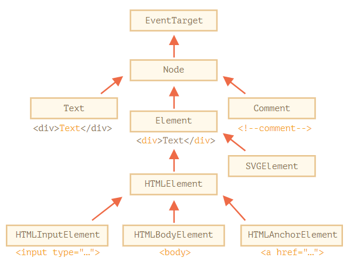

## DOM 노드 프로퍼티

<br><br>

### DOM 노드 클래스

---

DOM 노드는 종류에 따라 각각 다른 property를 지원합니다.

예를 들면, 태그 a에 대응하는 요소 노드엔 링크와 관련된 프로퍼티가 있고 input에 대응하는 요소 노드엔 입력과 관련된 프로퍼티가 있습니다.

그러나, 모든 DOM 노드는 `공통 조상`으로부터 만들어지기 때문에 `공통 프로퍼티와 메서드`가 있습니다.

<br><br>

다음은 DOM 노드의 계층구조입니다.



각 노드에 대응하는 클래스는 다음과 같이 정의할 수 있습니다.

- [EventTarget](https://dom.spec.whatwg.org/#eventtarget) – 루트에 있는 ‘추상(abstract)’ 클래스로, 이 클래스에 대응하는 객체는 실제로 만들어지지 않습니다. 모든 DOM 노드의 베이스 역할을 하므로 DOM 노드에서 '이벤트’를 사용할 수 있습니다. 자세한 내용은 곧 다루겠습니다.
- [Node](http://dom.spec.whatwg.org/#interface-node) – 이 역시 ‘추상’ 클래스로 DOM 노드의 베이스 역할을 합니다. getter 역할을 하는 `parentNode`, `nextSibling`, `childNodes` 등의 주요 트리 탐색 기능을 제공합니다. `Node` 클래스의 객체는 절대 생성되지 않지만 이 클래스를 상속받는 클래스가 여럿 있습니다. 텍스트 노드를 위한 `Text` 클래스와 요소 노드를 위한 `Element` 클래스, 주석 노드를 위한 `Comment`클래스는 `Node`클래스를 상속받습니다.
- [Element](http://dom.spec.whatwg.org/#interface-element) – DOM 요소를 위한 베이스 클래스입니다. `nextElementSibling`, `children` 같은 요소 전용 탐색 기능과 `getElementsByTagName`, `querySelector` 같은 요소 전용 검색 기능을 제공합니다. 브라우저는 HTML뿐만 아니라 XML, SVG도 지원하는데 `Element` 클래스는 이와 관련된 `SVGElement`, `XMLElement`, `HTMLElement` 클래스의 베이스 역할을 합니다.
- [HTMLElement](https://html.spec.whatwg.org/multipage/dom.html#htmlelement) – HTML 요소 노드의 베이스 역할을 하는 클래스입니다. 아래 나열한 실제 HTML 요소에 대응하는 클래스들은 `HTMLElement`를 상속받습니다.
    - [HTMLInputElement](https://html.spec.whatwg.org/multipage/forms.html#htmlinputelement) – `<input>` 요소를 위한 클래스
    - [HTMLBodyElement](https://html.spec.whatwg.org/multipage/semantics.html#htmlbodyelement) – `<body>` 요소를 위한 클래스
    - [HTMLAnchorElement](https://html.spec.whatwg.org/multipage/semantics.html#htmlanchorelement) – `<a>` 요소를 위한 클래스
    - 이외에도 다른 클래스가 많은데, 각 태그에 해당하는 클래스는 고유한 프로퍼티와 메서드를 지원합니다.

위와 같이 특정 노드에서 사용할 수 있는 프로퍼티와 메서드는 상속을 기반으로 결정됩니다.

`<input>` 요소에 대응하는 DOM 객체를 예로 들어봅시다. 이 객체는 [HTMLInputElement](https://html.spec.whatwg.org/multipage/forms.html#htmlinputelement) 클래스를 기반으로 만들어집니다.

객체엔 아래에 나열한 클래스에서 상속받은 프로퍼티와 메서드가 있을 겁니다.

- `HTMLInputElement` – 입력 관련 프로퍼티를 제공하는 클래스
- `HTMLElement` – HTML 요소 메서드와 getter, setter를 제공하는 클래스
- `Element` – 요소 노드 메서드를 제공하는 클래스
- `Node` – 공통 DOM 노드 프로퍼티를 제공하는 클래스
- `EventTarget` – 이벤트 관련 기능을 제공하는 클래스
- `Object` – `hasOwnProperty`같이 ‘일반 객체’ 메서드를 제공하는 클래스


<br><br>

그리고, 이러한 DOM 클래스들에 대한 명세서는 자바스크립트를 사용하는 것이 아니라, Interface description language(IDL)을 이용해 설명합니다.

다음 코드는 IDL로 이루어진 HTMLInputElement에 대한 명세서입니다.

```
// HTMLInputElement 정의 시작
// 콜론(:)은 HTMLInputElement가 HTMLElement로 부터 상속되었다는 것을 의미합니다.
interface HTMLInputElement: HTMLElement {
  // <input> 요소와 관련된 프로퍼티와 메서드가 나열되기 시작합니다.

  // 'DOMString'은 프로퍼티 값이 문자열이라는 것을 의미합니다.
  attribute DOMString accept;
  attribute DOMString alt;
  attribute DOMString autocomplete;
  attribute DOMString value;

  // 불린 값(true/false)을 가지는 프로퍼티
  attribute boolean autofocus;
  ...
  // 'void'는 메서드의 리턴값이 없음을 의미합니다.
  void select();
  ...
	}
```

<br><br><br>

### innerHTML로 내용 조작하기

---

innerHTML property를 사용하면 요소 안의 HTML을 문자열 형태로 받아올 수 있습니다.

그러나, 요소 안의 HTML을 수정하는 것도 가능합니다.

```html
<!doctype html>
<body>
  <p>P 태그</p>
  <div>div 태그</div>

  <script>
    alert( document.body.innerHTML ); // 현재 내용을 읽음
    document.body.innerHTML = '새로운 BODY!'; // 교체
  </script>

</body>
```

주의 사항으로는 innerHTML에 script 태그를 삽입하면 실행이 제대로 되지 않는 현상이 있었습니다.

그래서, `innerHTML property를 이용할 때 script 태그를 삽입하지 않기`를 바랍니다.

<br><br><br>

### 'innerHTML += ' 사용 주의점

---

`elem.innerHTML+="추가 html"`을 사용하면 요소에 HTML을 추가할 수 있습니다.

그러나, 이것은 다음과 같이 동작합니다.

1. 기존 내용 삭제
2. 기존 내용과 새로운 내용을 합친 새로운 내용을 씀

기존 내용을 '완전히 삭제’한 후 밑바닥부터 다시 쓰기 때문에 이미지나 리소스 전부가 다시 불러와 집니다.

이런 점을 해결하기 위해, `elem.appendChild(node)` 를 통해 해결을 할 수 있습니다.

<br><br>

예제 코드는 다음과 같습니다.

```html
<!doctype html>

<body>
    <script>
        let divTag = document.createElement('div'); // 원하는 형태의 요소를 만듭니다.
        divTag.innerHTML = '이건 appendChild'; // innerHTML property를 이용해 원하는 값을 넣습니다.
        document.body.appendChild(divTag); // body 뒤에 붙입니다.
    </script>
</body>
```

<br><br><br>

### outerHTML

---

outerHTML은 innerHTML과 달리, element를 바꾸지는 않습니다. 그러나 DOM  안의 요소를 교체합니다.

```html
<!doctype html>
<body>
<div>Hello, world!</div>

<script>
  let div = document.querySelector('div');

  // div.outerHTML를 사용해 <p>...</p>로 교체
  div.outerHTML = '<p>새로운 요소</p>'; // (*)

  // 어! div는 그대로네요!
  alert(div.outerHTML); // <div>Hello, world!</div> (**)
</script>
</body>
```

결론적으로, `outerHTML은 div element요소를 건들지 않는다`는 점입니다. 

그래서, outerHTML로 `새롭게 변경된 것을 참고하려면 DOM 쿼리 메소드를 사용해야 한다`는 것입니다.

<br><br><br>

### textContent

---

textContent를 사용하면 요소 내의 텍스트에 접근할 수 있습니다.


```html
<!doctype html>
<body>
<div id="elem1"></div>
<div id="elem2"></div>

<script>
  let name = prompt("이름을 알려주세요.", "<b>곰돌이 푸!</b>");

  elem1.innerHTML = name;
  elem2.textContent = name;
</script>
</body>
```

- `innerHTML`을 사용하면 사용자가 입력한 문자열이 ‘HTML 형태로’ 태그와 함께 저장됩니다.
- `textContent`를 사용하면 사용자가 입력한 문자열이 ‘텍스트 형태로’ 저장되어 `태그를 구성하는 특수문자들도 문자열로 처리`됩니다