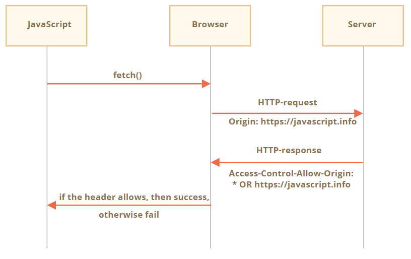
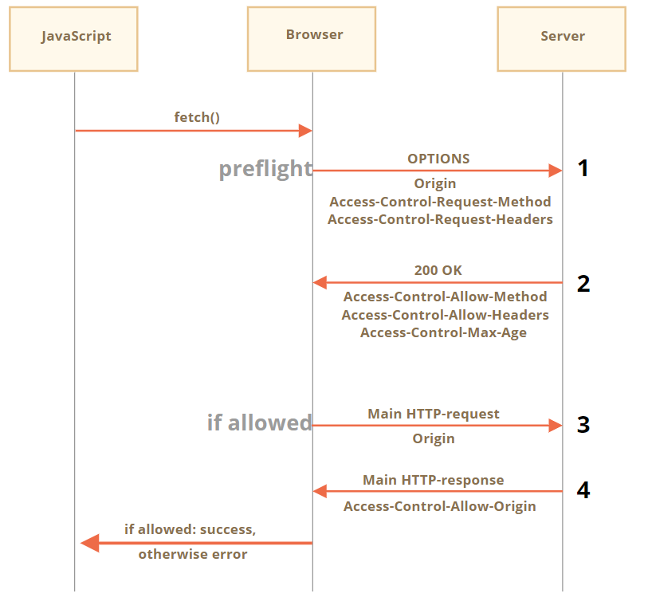

## Cross Origin Resource Sharing

CORS는 `해커로부터 인터넷을 보호하기 위해 만들어졌습니다`.

`XSS` 해킹 기법을 통해, 해커들이 주로 공격을 하는데 그 부분을 막기 위해 만들어졌습니다

(요약하면 client가 a사이트에 있는데, 해커가 정보를 빼내려고 스크립트파일을 넣어서 다른 도메인사이트로 호출이 되는 경우 해킹이 되는 원리입니다)

<br><br>

이런 경우를 막기위해서 다른 호스트의 웹 사이트에 접근할 수 없게 원칙적으로 만들었습니다.

그러나, 다른 호스트의 웹 사이트에 접근을 해야하는 경우가 생겼습니다. 

예를 들면, Front-end와 Back-end를 따로 구축을 하는 경우가 대표적인 경우라고 볼 수 있습니다.

그래서, Cross Origin 요청에 대한 방법들이 있습니다.

<br><br><br>


### Simple 요청

---

1. simple 요청
2. non-simple 요청(simple 요청이 아닌 요청)

2가지가 있는데, 먼저 simple 요청에 대해 알아보겠습니다.

simple 요청은 다음의 2가지를 만족해야 합니다.

1. simple method(simple 메소드) – GET이나 POST, HEAD 메서드를 사용한 요청
2. simple header(simple 헤더) – 다음 목록에 속하는 헤더
    - `Accept`
    - `Accept-Language`
    - `Content-Language`
    - 값이 `application/x-www-form-urlencoded`이나 `multipart/form-data`, `text/plain`인 `Content-Type`

<br><br>
Cross Origin 요청을 보낼 경우, `항상 Origin 이라는 헤더를 추가`합니다.

서버는 요청 헤더에 있는 Origin이 받아야 하는지 말아야 하는지 판단을 해야 하기 때문입니다. 이미 약속이 된 Origin이라면, `Access-Control-Allow-Origin` header를 추가하여 origin 정보나 *이 있는 형태를 받게 되면 fetch가 성공하게 됩니다. 



<br><br><br>

### non simple 요청

---

과거의 웹페이지의 경우는 GET이나 POST이외의 메소드가 들어오게 되면, 이건 브라우져가 보낸것이 아니라고 판단하고 접근권한을 확인합니다.

이것은 non simple 요청을 할 경우에 발생할 수 있는 예상된 문제입니다.

그래서, non simple 요청에서는 `사전에 미리 서버에 보내서 권한이 있는지 미리 확인하는 절차가 추가`됩니다.



<br><br>

추가적으로, fetch를 이용해서 보내는 경우 `쿠키나 HTTP 인증같은 정보는 담기지 않습니다`. 왜냐하면, 자격 증명이 함께 전송되면 사용자가 대신에 자바스크립트가 민감한 정보에 접근을 할 수도 있기 때문입니다.

`하지만, 서버에서 이를 허용하고 싶다면` 

`credentials: "include"` 옵션을 추가해주면 됩니다.

```jsx
fetch('http://another.com', {
  credentials: "include"
});
```

위처럼 자격증명이 포함된 형태로 보내게 되면, Origin이 절대 Access-Control-Allow-Origin에 *을 쓸 수 없습니다. 왜냐하면, 서버는 어떤 Origin에서 요청이 온건지 신뢰를 해야 하기 때문입니다.

```jsx
200 OK
Access-Control-Allow-Origin: https://javascript.info // 2. *은 절대 쓸 수 없습니다.
Access-Control-Allow-Credentials: true // 1. 인증을 허용하게 되면
```

출처 : [https://ko.javascript.info/fetch-crossorigin](https://ko.javascript.info/fetch-crossorigin)