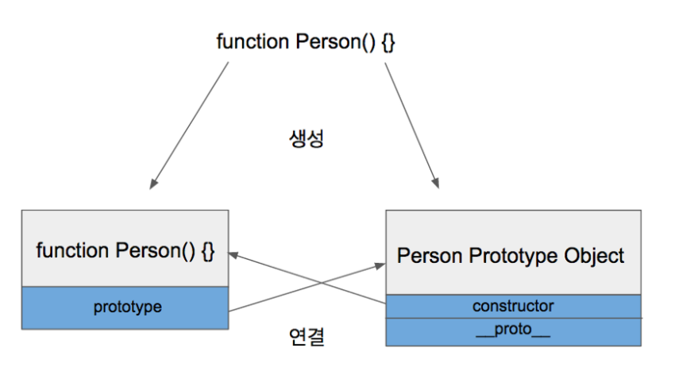
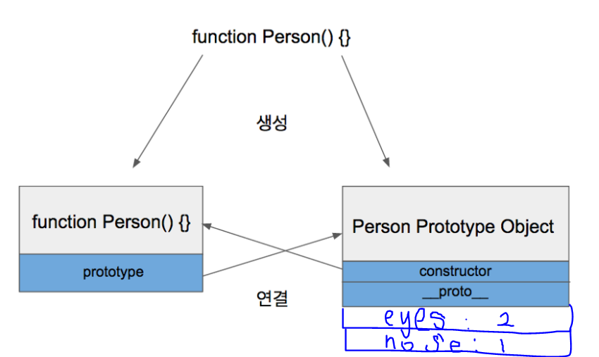
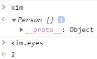
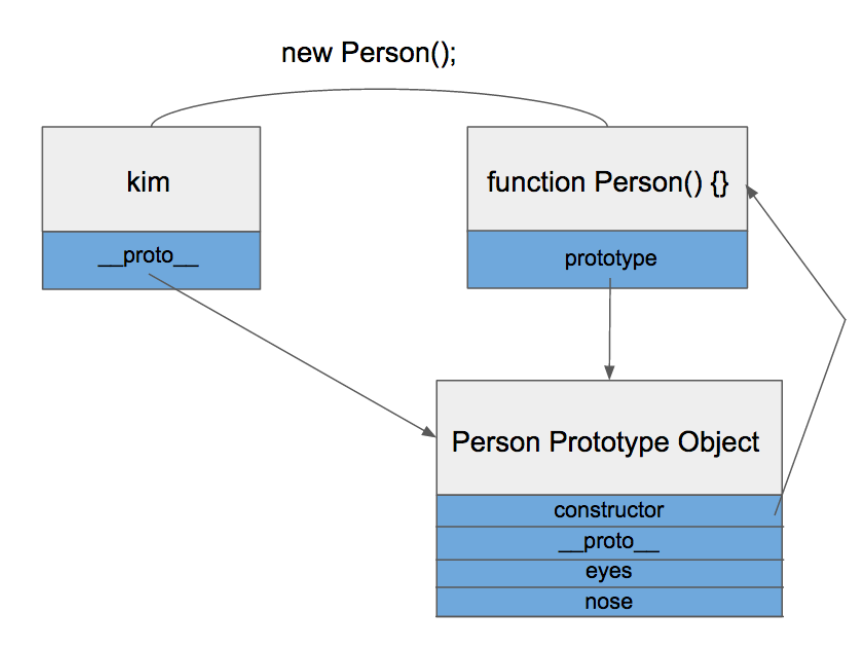
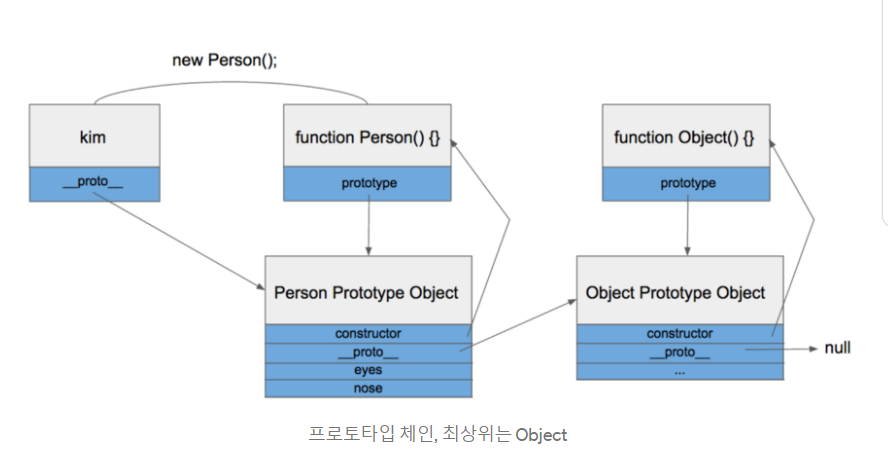

## Prototype 이해하기

JavaScript는 `Prototype 기반 언어`라고 불립니다.

그래서, JavaScript는 class 라는 개념이 없습니다.(물론 ES6 이후에 class 문법이 추가되었습니다)

하지만 추가된 문법의 class도 function의 형태입니다. 

결국 JavaScript는 function을 가지고 class 처럼 사용을 하고 있다는 것입니다.

```jsx
function Person() {
  this.eyes = 2;
  this.nose = 1;
}
var kim  = new Person();
var park = new Person();
console.log(kim.eyes);  // => 2
console.log(kim.nose);  // => 1
console.log(park.eyes); // => 2
console.log(park.nose); // => 1
```

function의 this키워드를 통해 class의 member 변수처럼 유사하게 만들어서 사용을 하고 있습니다.

<br><br>

하지만 이 코드는 prototype을 이용해 다음과 같이 쓸 수 있습니다.

```jsx
function Person() {}
Person.prototype.eyes = 2;
Person.prototype.nose = 1;
var kim  = new Person();
var park = new Person():
console.log(kim.eyes); // => 2
```

<br><br><br>

### Prototype Link와 Prototype Object

---

JavaScript에는 `PrototypeLink 그리고 Prototype Object가 있는데, 두 개를 합쳐서 Prototype`이라고 부릅니다.

먼저, `Prototype Object`는 `function을 정의 했을때, function과 함께 생성되는 또다른 Object 값`입니다. (추가적으로, function이 정의되면, 해당 function에 constructor 자격이 부여됩니다)

<br><br>

그럼 아래와 같이 만들어집니다.



Person.prototype이 Person Prototype Object를 가리키고, 반대로 Person Prototype Object 내부에 있는 constructor가 Person 함수를 가리키게 됩니다.

```jsx
Person.prototype.eyes = 2;
Person.prototype.nose = 1;
```

<br><br>

이 때, prototype에 eyes와 nose라는 property들을 각각 추가하게 되면 다음과 같은 그림으로 바뀝니다.



<br><br>

이렇게 된후, kim이라는 변수에 new 연산자를 할당하여 만들었습니다.

그런데, kim이라는 변수에서 eyes나 nose가 보이지 않는 현상이 생깁니다.

그런데 이상하게도, kim.eyes값에 접근이 가능하다는 점입니다.



<br><br>

이것은 proto 때문입니다.

__proto__는 `객체가 생성될 때 조상이었던 함수의 Prototype Object를 가리킵니다`. kim객체는 Person함수로부터 생성되었으니 Person 함수의 Prototype Object를 가리키게 됩니다.
<br><br>



kim 객체 자체가 eyes나 nose라는 property를 가지고 있지 않기 때문에, proto 를 이용해 상위 function으로 계속 이동하면서 알맞은 property를 찾기 때문에

위와 같은 현상이 발생하게 되는 것입니다.

이것을 `프로토타입 체인`이라고 부릅니다.

<br><br>



일반화 시키게 되면, 다음과 같은 그림으로 설명이 될 수 있습니다.

그래서, 이런 속성때문에 Object Prototype에 있는 모든 property들을 사용할 수 있습니다.

<br><br><br>

출처 : [https://medium.com/@bluesh55/javascript-prototype-이해하기-f8e67c286b67](https://medium.com/@bluesh55/javascript-prototype-%EC%9D%B4%ED%95%B4%ED%95%98%EA%B8%B0-f8e67c286b67)