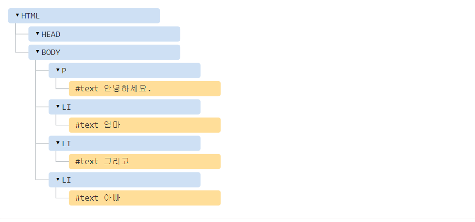

## DOM

---

문서 객체 모델(Document Object Model, DOM)은 `웹 페이지 내의 모든 컨텐츠를 객체로 `나타냅니다.

document 객체는 페이지의 기본 '진입점' 역할을 합니다. document 객체를 이용해 페이지 내의 원하는 것을 수정 및 삭제 혹은 추가할 수도 있습니다.

<br><br><br>

### DOM 예제와 구조

---

다음의 DOM 예제코드를 통해, DOM 구조를 한번 알아 보겠습니다.

```html
<!DOCTYPE HTML>
<html>
<head>
  <title>사슴에 관하여</title>
</head>
<body>
  사슴에 관한 진실.
</body>
</html>
```

<br><br>

DOM은 HTML을 아래의 태그 트리 구조로 표현합니다.


태그는 요소 노드(element node)라고 불리며, 트리 구조를 구성합니다.

- <html>은 루트 노드, <head>와 <body>는 '루트 노드의 자식'이므로 자식 노드

요소 내의 문자는 텍스트(text) 노드가 됩니다. 텍스트 노드는 문자열만 담고, 

자식 노드는 가질 수 없다보니, 잎 노드(leaf node)가 됩니다.


<br><br><br>

### 자동 교정

---

브라우저는 비정상적인 HTML을 만나도 자동으로 교정을 해줍니다.

다음의 코드처럼 닫힌 태그가 없는 경우를 예를 들어보겠습니다.

```html
<p>안녕하세요
<li>엄마
<li>그리고
<li>아빠
```

<br><br>

이렇게 태그 짝이 안맞아도, 브라우져는 태그를 읽고 자동으로 빠진 부분을 채워줍니다.



<br><br>

이외에도 다양한 노드 타입들이 존재하는데, 주로 다음 4가지 노드를 다룹니다.

1. DOM의 '진입점"이 되는 `문서(document)` 노드
2. HTML 태그에서 만들어지며, DOM 트리를 구성하는 블록인 요소 노드(element node)
3. 텍스트를 포함하는 텍스트 노드(text node)
4. 화면에 보이지는 않지만, 정보를 기록하고 자바스크립트를 사용해 이 정보를 DOM으로부터 읽을 수 있는 주석(comment) 노드